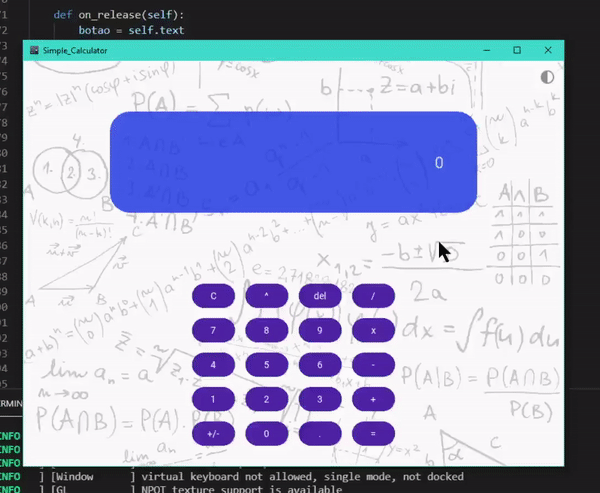

# Simple_Calculator
It's just a simple calculator built using kivy and kivymd, which are python libraries.

  

  

# Requirements

- Kivy - 2.0.0
- KivyMD  - https://github.com/kivymd/KivyMD/archive/master.zip
